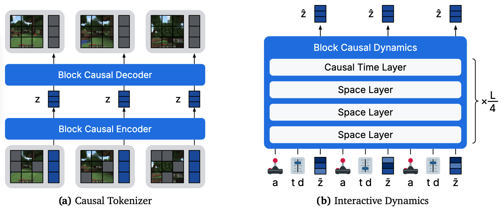
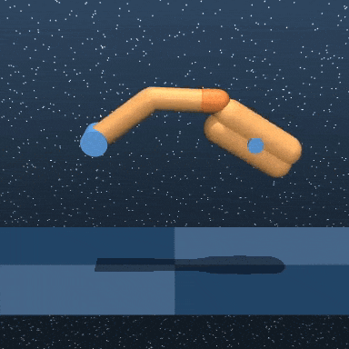
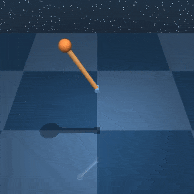
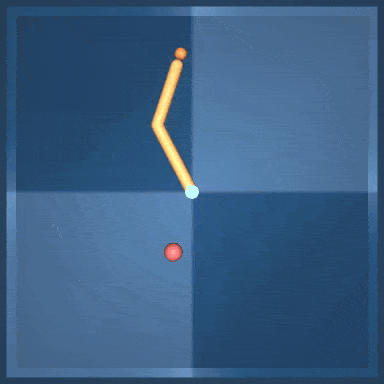
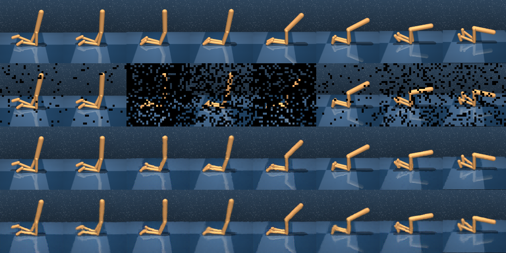
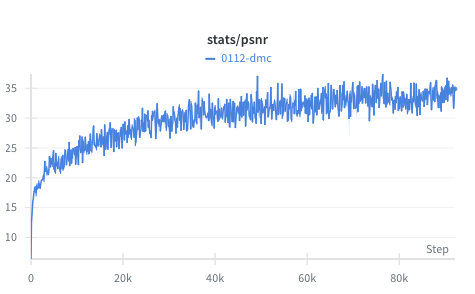
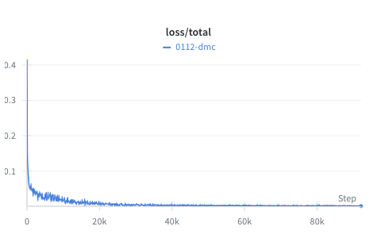
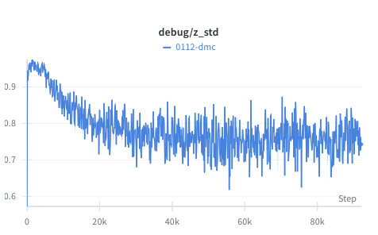
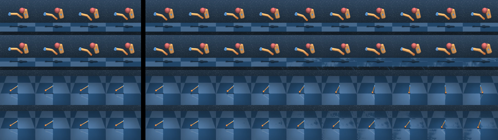
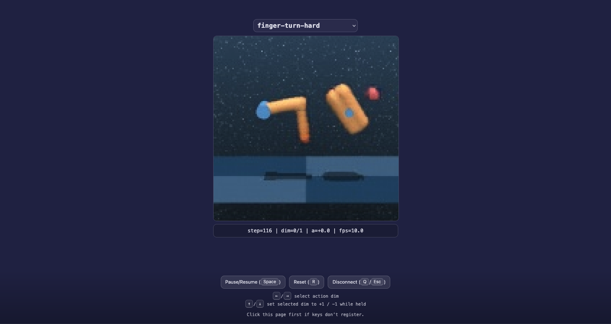

<h1>Dreamer 4 in PyTorch</span></h1>

This is an *unofficial* PyTorch implementation of the Dreamer 4 world model from the paper [*Training Agents Inside of Scalable World Models*](https://arxiv.org/abs/2509.24527) by Danijar Hafner, Wilson Yan, Timothy Lillicrap.

Our implementation is not a complete reproduction of the original work, but we believe that it may serve as a good starting point for anyone looking to extend or experiment with the Dreamer 4 architecture. Notably, the original paper applies Dreamer 4 to Minecraft (discrete actions) whereas this implementation applies it to **multi-task DMControl** (continuous actions). We welcome contributions to improve the codebase and bring it closer to the original paper.

This PyTorch implementation is loosely based on [Edward Hu](https://github.com/edwhu)'s [JAX implementation](https://github.com/edwhu/dreamer4-jax).

----

## Architecture



Dreamer 4 consists of a causal tokenizer and an interactive dynamics model, which both use the same block-causal transformer architecture. The tokenizer encodes partially masked image patches and latent tokens, squeezes the latents through a low-dimensional projection with tanh activation, and decodes the patches. It uses causal attention to achieve temporal compression while allowing frames to be decoded one by one. The dynamics model operates on the interleaved sequence of actions, shortcut noise levels and step sizes, and tokenizer representations. It denoises representations via a shortcut forcing objective.

----

## Dataset

</br>

We will be using mixed-quality trajectory data spanning **30 continuous control tasks** from [DMControl](https://arxiv.org/abs/1801.00690) and [MMBench](https://arxiv.org/abs/2511.19584). The dataset contains 240 trajectories per task for a total of 7,200 trajectories (3.6M frames), and is collected using expert [TD-MPC2](https://www.tdmpc2.com) agents that were released as part of our [Newt/MMBench](https://www.nicklashansen.com/NewtWM) project. Our dataset will soon be made publicly available on [HuggingFace](https://huggingface.co/nicklashansen). In the meantime, refer to the [Newt repository](https://github.com/nicklashansen/newt) for information on how you can generate your own data; our data generation procedure is very similar but not identical to that of Newt.

In the following, we will walk you through training a **single** world model on **all 30 tasks**, as well as how to interact with it via a simple web interface.

----

## Installation

We recommend installing dependencies in a virtual environment. We provide an `environment.yaml` file for easy installation with [Conda](https://docs.conda.io/en/latest/):

```
conda env create -f environment.yaml
conda activate dreamer4
```

This will install *most* of the required packages, however, this repository is still a work in progress and I need to compile a more refined `environment.yaml` file.

----

## Training the Tokenizer



To train the Dreamer 4 tokenizer, run the following command:

```
torchrun --nproc_per_node=8 train_tokenizer.py
```

This will start the training process using 8 GPUs. The tokenizer checkpoints will be saved in the `./logs/tokenizer_ckpts/` directory by default. You can change this path using the `--ckpt_dir` argument.

You can expect training to take approximately 24 hours on 8× RTX 3090 GPUs, after which you should see curves that look something like this:

</br>

----

## Training the World Model



To train the Dreamer 4 dynamics model with action conditioning, run the following command:

```
torchrun --nproc_per_node=8 train_dynamics.py --use_actions
```

This will start the training process using 8 GPUs. Note that this script assumes that you already have a trained tokenizer; if your tokenizer is located at a different path than the default `./logs/tokenizer_ckpts/latest.pt`, you can specify it using the `--tokenizer_ckpt` argument. You can expect training to take approximately 48 hours on 8× RTX 3090 GPUs.

----

## Interactive Web Interface



We provide a simple web interface to interact with the trained world model. To start the web server, run the following command:

```
python interactive.py
```

and navigate to `http://localhost:7860` in your web browser (assuming you are running it locally and use the default port `7860`). If you are running the web server on a remote (headless) machine, you should still be able to view it locally in your browser after forwarding via SSH, e.g.

```
ssh -L 7860:127.0.0.1:7860 user@remote-machine
```

assuming the web server is running on `remote-machine` and you want to forward it to your local port `7860`. You can customize the port using the `--port` argument.

----

## Checkpoints

Pre-trained tokenizer and dynamics model checkpoints will be made available soon.

----

## Contributing

You are very welcome to contribute to this project! We especially welcome contributions to improve the codebase and bring it closer to the original paper. Feel free to open an issue or pull request if you have any suggestions or bug reports, but please review our [guidelines](CONTRIBUTING.md) first.

----

## License

This project is licensed under the MIT License - see the `LICENSE` file for details. Note that the repository relies on third-party code, which is subject to their respective licenses.

----

## References

- [Training Agents Inside of Scalable World Models](https://arxiv.org/abs/2509.24527) - Danijar Hafner, Wilson Yan, Timothy Lillicrap
- [Learning Massively Multitask World Models for Continuous Control](https://arxiv.org/abs/2511.19584) - Nicklas Hansen, Hao Su, Xiaolong Wang
- [TD-MPC2: Scalable, Robust World Models for Continuous Control](https://arxiv.org/abs/2310.16828) - Nicklas Hansen, Hao Su, Xiaolong Wang
- [Dreamer4 JAX Implementation](https://github.com/edwhu/dreamer4-jax) - Edward Hu
